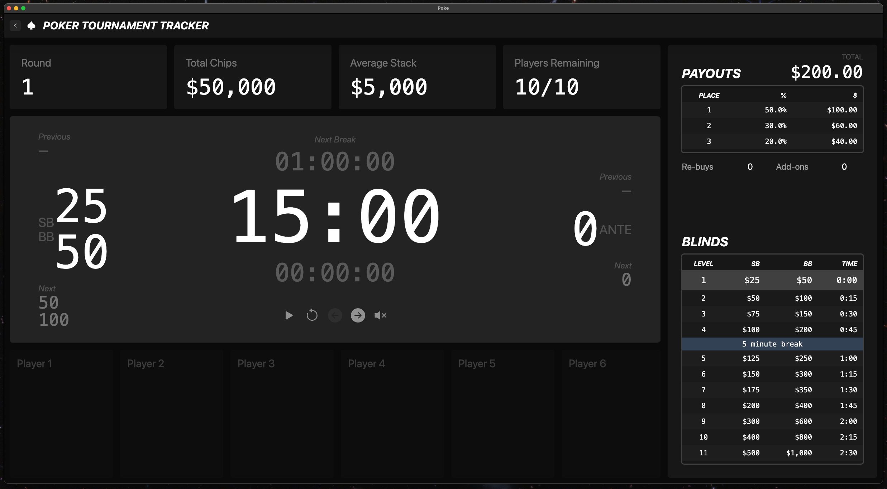

# Poke 
### Poker Tournament Manager
A poker tournament setup and management application. Meant to help make home tournaments go more smoothly, minimizing setup time so that you can get to the fun part.




## Getting Started
### Prerequisites
This project requires npm and node. In order to check if you have node installed run
```bash
node -v
```
and
```bash
npm -v
```
### Installation
In order to create a build version of this application, you will need a separate electron packaging and distribution tool such as [Electron Forge](https://www.electronforge.io/). Below are the steps to run the application in development mode.

1. Clone the repo.
	```bash
	git clone https://github.com/jnarcher/poke.git
	```
2. Install dependencies
	```bash
	cd poke && npm i
	```
3. Run the application in development mode 
	```bash
	npm run dev
	```
